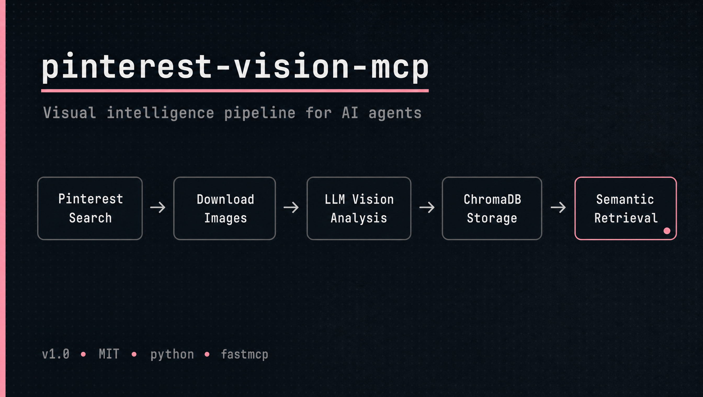

# 🔍 pinterest-vision-mcp

[](https://python.org)
[](LICENSE)
[](https://modelcontextprotocol.io)
[](https://www.trychroma.com)

> MCP server that gives AI agents visual intelligence — search Pinterest, analyze images with LLM vision, build a semantic reference library, and retrieve by style or mood.

## Why

AI agents are good at text. They're not good at having taste.

When building AI production workflows, I kept running into the same problem: an agent could write a creative brief but couldn't tell a quiet luxury editorial from a fast fashion product shot. To make agents genuinely useful for visual work, they need a visual memory — a structured, searchable library of aesthetic references they can learn from and query.

Pinterest is the largest public mood board on the internet. This server connects it to your agents.

## ✨ Features

- 🔎 **Pinterest search** — query any visual style, aesthetic concept, or reference
- 📥 **Image download** — bulk save to local storage, organized by session and query
- 🧠 **LLM vision analysis** — structured tags per image: lighting, mood, palette, segment, shot type, brand feel
- 🗃️ **Vector storage** — ChromaDB with semantic embeddings
- 🔁 **One-call pipeline** — `pinterest_pipeline` runs the full workflow in a single tool call
- 🔍 **Semantic retrieval** — `visual_search` finds references by vibe, not just keywords

## How it works

```
search → download → LLM vision analysis → ChromaDB → semantic retrieval
```

1. **Search** Pinterest for visual references
2. **Download** images locally, organized by date and query
3. **Analyze** each image with a vision LLM → structured aesthetic tags
4. **Store** in ChromaDB vector database
5. **Retrieve** semantically — "dark masculine editorial close-up" finds the right images even if those words aren't in the original captions

Or run the full pipeline in one call with `pinterest_pipeline`.

## Use cases

**Creative AI workflows** — give agents a visual vocabulary. Instead of relying on text descriptions alone, agents query the library for structured references and use their extracted parameters to guide image generation.

**Visual direction** — an agent briefing an image model pulls references from the library, extracts their lighting type, composition, and palette, and uses those as structured input.

**Style consistency** — build a visual library from existing brand photography, then use `visual_search` to verify that new images match the established aesthetic.

**Moodboard automation** — agents autonomously search, analyze, and organize visual inspiration around any brief.

## Requirements

- Python 3.10+
- API key for any **OpenAI-compatible vision API** (OpenRouter, OpenAI, Groq, etc.)

> **Cost note:** image analysis calls a vision LLM. With `anthropic/claude-sonnet-4-6` via OpenRouter, 8 images cost roughly $0.01–$0.05.

## Quick Start

```bash
git clone https://github.com/Kreminskaya/pinterest-vision-mcp.git
cd pinterest-vision-mcp
pip install -e .
cp .env.example .env
# set VISION_API_KEY in .env
```

## MCP configuration

Works with any MCP-compatible client — Claude Desktop, Cursor, Hermes, or your own agent.
Replace `/absolute/path/to/pinterest-vision-mcp` with the real path.

```json
{
  "mcpServers": {
    "pinterest-vision": {
      "command": "python",
      "args": ["-m", "pinterest_vision_mcp.server"],
      "cwd": "/absolute/path/to/pinterest-vision-mcp",
      "env": {
        "VISION_API_KEY": "your_key_here"
      }
    }
  }
}
```

The same JSON block works across all clients that support MCP stdio transport.

## Environment variables

| Variable | Default | Description |
|---|---|---|
| `VISION_API_KEY` | — | **Required.** API key for your LLM provider |
| `VISION_API_BASE_URL` | `https://openrouter.ai/api/v1` | Base URL (any OpenAI-compatible API) |
| `PINTEREST_VISION_MODEL` | `anthropic/claude-sonnet-4-6` | Any vision-capable model |
| `PINTEREST_DATA_DIR` | `./data` | Directory for downloaded images |
| `CHROMA_PERSIST_DIR` | `./data/chroma` | ChromaDB vector storage path |

**Supported providers:**

```bash
# OpenRouter (Claude, GPT-4o, Llama, and 200+ more)
VISION_API_BASE_URL=https://openrouter.ai/api/v1
PINTEREST_VISION_MODEL=anthropic/claude-sonnet-4-6

# OpenAI
VISION_API_BASE_URL=https://api.openai.com/v1
PINTEREST_VISION_MODEL=gpt-4o-mini

# Groq
VISION_API_BASE_URL=https://api.groq.com/openai/v1
PINTEREST_VISION_MODEL=llama-3.2-11b-vision-preview
```

## Tools

| Tool | Description |
|---|---|
| `pinterest_search` | Search Pinterest by query — returns pins with image URLs |
| `pinterest_download` | Download images from search results to local disk |
| `pinterest_analyze` | Analyze images with LLM vision — returns structured aesthetic tags |
| `pinterest_ingest` | Store analyses in ChromaDB for semantic retrieval |
| `pinterest_pipeline` | Full pipeline in one call: search → download → analyze → store |
| `visual_search` | Semantic search across stored visual references |

## Visual analysis schema

Each analyzed image returns:

| Field | Example values |
|---|---|
| `lighting_type` | natural, studio, golden hour, overcast |
| `composition_type` | centered, rule-of-thirds, flat lay, symmetrical |
| `camera_distance` | close-up, medium, full body, detail shot |
| `mood` | editorial, minimal, dark, romantic, energetic |
| `palette` | free-text color description |
| `segment` | luxury / premium / contemporary / streetwear |
| `shot_type` | campaign editorial / e-commerce product / lookbook |
| `garment_focus` | clothing items featured |
| `styling_signals` | styling details and accessories |
| `brand_feel` | brand aesthetic impression |
| `overall_quality` | reference-worthy / average / not useful |
| `raw_description` | 2–3 sentence summary |

## Usage

```python
# Full pipeline — search, download, analyze, store in one call
result = pinterest_pipeline(
    query="quiet luxury beige coat editorial",
    limit=15,
    max_download=8,
)
# "Complete: 15 found, 8 downloaded, 8 analyzed, 8 stored"

# Semantic search across the visual library
refs = visual_search(
    query="dark masculine editorial close-up",
    segment="luxury",
    shot_type="campaign editorial",
    n_results=10,
)

# Step-by-step (for more control)
search = pinterest_search(query="minimal white studio editorial", limit=20)
download = pinterest_download(search_result=search, max_images=10)
analyses = pinterest_analyze(image_paths=[a["local_path"] for a in download["downloaded"]])
pinterest_ingest(analyses=analyses, query="minimal white studio")
```

## First run note

On the first call to `pinterest_ingest` or `pinterest_pipeline` with `ingest=True`, ChromaDB downloads a sentence transformer embedding model (~90 MB). This happens once and is cached locally.

## Disclaimer

Uses [`pinterest-dl`](https://github.com/pinpie/pinterest-dl) for Pinterest access. Use responsibly per Pinterest's [Terms of Service](https://policy.pinterest.com/en/terms-of-service).

## License

MIT
